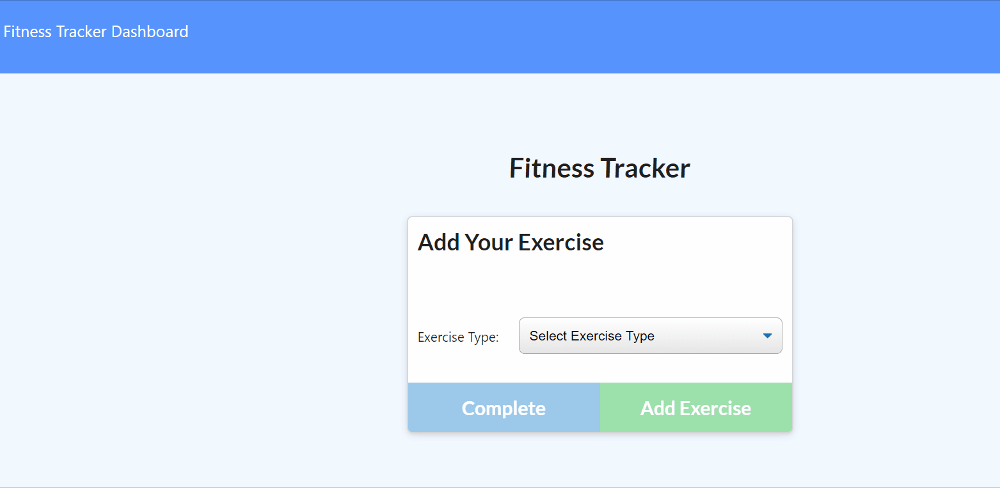

# Denver through the Decades

### Table of Contents:

- [User Story](##-User-Story)
- [Description](##-Description)
- [Installation](##-Installation)
- [Credits](##-Credits)
- [License](##-License)

## Deployed site

[Fitness Tracker](https://guarded-inlet-54288.herokuapp.com/)

## User Story

II am new to working out and I want to track my fitness workouts in an easy place to see.

## Description

Using Node, Express, HTML and CSS I have created an easy to navigate fitness app.

## Installation

This application does involve Node and Express. You will need to run an

- npm i \*
  to be able to get the application running on your local repo.

## Credits

- [Express](https://www.npmjs.com/package/express)
- [Mongoose](https://www.npmjs.com/package/mongoose)
- [NodeJs]

## License

This project is licensed by MIT
